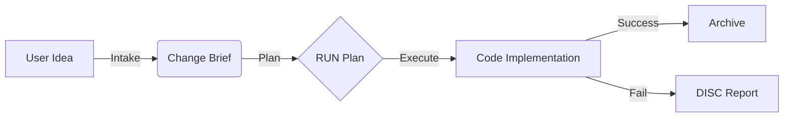

# MemoryAtlas

> Document-Driven Development with MCP (Intake -> Plan -> Execute)

[English](README.en.md) | [한국어](README.md)

## 0. What is this document?

This is the official guide for first-time users of MemoryAtlas.
It goes beyond installation and defines the system's **mental model** and collaboration **protocol**.

### What this document covers

- Why this project exists
- Roles of documents and LLMs (R&R)
- The end-to-end workflow
- MCP-based automation flow

> Core summary: documents are the authority, and LLMs automate planning, implementation, and closure.

## 1. Why this project exists

### 1.1 Base assumptions

If all required documents are complete, an LLM can complete the project automatically.
Those documents must be:

- Human-readable and clear
- Interpreted consistently by different people/LLMs
- Editable by humans when needed

### 1.2 MemoryAtlas choice

We do not try to control code directly.
We treat **documents as authority**, and code as a **derived artifact**.

"Write the documents well, and the code will follow."

## 2. Conceptual flow

MemoryAtlas systematizes the ideal human workflow:

- CQ (Competency Questions): "What question must this capability answer?"
- Intake: turn rough thoughts into a Brief
- Plan: lock the Brief into a RUN plan
- Execute: implement based on the RUN
- Archive: store completed records

## 3. Two ways to operate

### 3.1 Manual flow (without MCP)

You can run the project with documents only.
However, **Intake requests must be performed via MCP**.
If MCP is unavailable, notify the user and fix MCP first.

- Write REQ directly
- Write RUN
- Implement
- Move to Archive

### 3.2 MCP flow (recommended, Intake required)

MCP **automates everything except user checkpoints**.

Step 1. Intake
- User: "I need this feature. Please intake it."
- System: creates a BRIEF
- User: review the BRIEF

Step 2. Plan
- User: "Plan from this Brief."
- System: create/update REQ + create RUN
- User: review the RUN

Step 3. Execute
- User: "Run."
- System: implement -> verify (--doctor) -> archive
- User: intervene only on failure

## 4. User touchpoints

Core rule: users decide; LLMs execute, organize, and validate.

| Phase | Artifact | User review |
|------|----------|-------------|
| Intake | Change Brief | required |
| Plan | RUN document | required |
| Execute | Code/results | only on failure |

## 5. Official 3-phase workflow

### Phase 1. Intake

- Goal: compress scattered requests into a single Change Brief
- Inputs: user language, DISC, chat logs
- Output: `02_REQUIREMENTS/discussions/briefs/BRIEF-*.md`
- Rule: **Intake must use MCP**; if MCP is unavailable, stop and fix MCP
- Affected Artifacts rule: use full paths or links (e.g., `02_REQUIREMENTS/capabilities/REQ-*.md`)

### Phase 2. Plan

- Goal: lock the Brief into an execution unit (RUN)
- Actions:
  - REQ is created/updated under `02_REQUIREMENTS/capabilities/REQ-*.md`
  - RUN document is created (Brief is Must-Read)
- Output: `04_TASK_LOGS/active/RUN-*.md`
- run_id is generated by the system; use the value returned by `plan_from_brief`

### Phase 3. Execute

- Goal: implement, verify, and close based on the RUN
- Actions:
  - Call `finalize_run(run_id)` after implementation
  - `--doctor` validation (success -> Archive, failure -> DISC)
- Output: `04_TASK_LOGS/archive/RUN-*.md`

## 6. MCP tool system

Primary tools (most work uses these three)

| Tool | Role | Trigger example |
|------|------|-----------------|
| `intake(...)` | collect request -> Brief | "Add this feature" |
| `plan_from_brief(...)` | approve Brief -> RUN | "Lock the plan" |
| `finalize_run(...)` | verify and archive | "Run" |

Note: use the **run_id returned by plan_from_brief** when calling `finalize_run`.

Auxiliary tools

- `validate(scope)`: manual validation (lint, links, doctor)
- `req_status(req_id)`: check REQ status
- `create_disc_from_failure(context)`: failure report

## 7. CQ-based writing

CQ-based inputs are free-form. Notes, chat logs, or transcripts are fine.
The system allows "rough thoughts -> Intake" without friction.

## 8. Onboarding

### 8.1 First steps

- Read this document
- Try: "Think of a feature -> say 'Intake please'"

### 8.2 Two phrases to remember

- Got an idea? Intake
- Want to execute? Plan -> Run

## 9. Final summary

MemoryAtlas does not force you to write more.
It lets you think, while LLMs handle docs, plans, implementation, and cleanup.

Two documents define the boundary:

- Change Brief: the gateway from idea to execution
- RUN: the single source of execution truth
