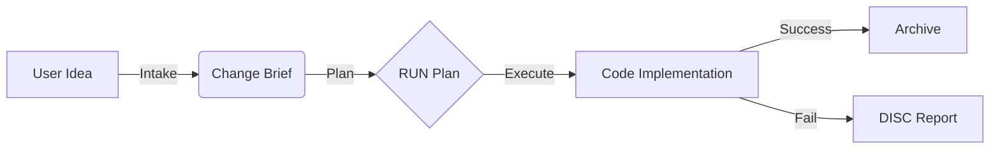

# MemoryAtlas

> Document-Driven Development with MCP (Intake -> Plan -> Execute)

[한국어](README.md) | [English](README.en.md)

## 0. 이 문서는 무엇인가?

이 문서는 MemoryAtlas를 처음 접하는 사용자가 시스템의 핵심 철학을 빠르게 이해하도록 돕는 공식 가이드입니다.
단순 설치 안내를 넘어, 시스템의 **Mental Model**과 **협업 Protocol**을 명확히 정의합니다.

### 이 문서가 설명하는 것

- 이 프로젝트를 만든 이유 (Why)
- 문서와 LLM의 역할 분담 (R&R)
- 전체 개발 프로세스 (Workflow)
- MCP 기반 자동화 흐름 (Automation)

> 핵심 요약: 사람 중심의 문서를 권위로 삼고, LLM은 계획-구현-정리를 자동화합니다.

## 1. 프로젝트를 만든 이유 (Why)

### 1.1 기본 전제

모든 필요 문서가 완벽히 존재한다면, LLM은 프로젝트를 자동으로 완성할 수 있습니다.
단, 그 문서는 다음 조건을 만족해야 합니다.

- 사람이 읽고 이해할 수 있어야 한다
- 여러 사람/여러 AI가 봐도 같은 의미로 해석되어야 한다
- 필요하면 사람이 직접 수정할 수 있어야 한다

### 1.2 MemoryAtlas의 선택

우리는 코드를 직접 제어하려 애쓰지 않습니다.
대신 **문서를 권위(Authority)**로 삼고, 코드는 문서에서 파생되는 **결과물(Artifact)**로 취급합니다.

"문서를 잘 쓰면, 코드는 따라온다."

## 2. 기본 사고 프로세스 (Conceptual Flow)

사람 기준의 이상적인 개발 흐름을 MemoryAtlas가 시스템화합니다.

- CQ(Competency Questions): "이 기능이 해결해야 할 질문은 무엇인가?"
- Intake: 정리되지 않은 생각/메모를 Brief로 변환
- Plan: Brief를 실행 계획(RUN)으로 고정
- Execute: RUN을 기준으로 구현
- Archive: 완료 기록 보관

## 3. 두 가지 사용 방식

### 3.1 수동 프로세스 (MCP 없이)

문서만으로도 프로젝트를 운영할 수 있습니다. 다만 **"Intake" 요청은 MCP 도구로만 수행**해야 합니다.
MCP가 불가능하면 먼저 알리고 MCP를 복구한 뒤 진행합니다.

- REQ 문서 직접 작성
- RUN 문서 작성
- 구현
- Archive 이동

### 3.2 MCP 기반 프로세스 (권장, Intake 필수)

MCP는 **사용자가 확인해야 할 지점만 남기고 나머지를 자동화**합니다.

Step 1. Intake (생각 정리)
- User: "이 기능 필요해. Intake 해줘."
- System: BRIEF 생성
- 사용자 할 일: BRIEF 검토

Step 2. Plan (계획 고정)
- User: "이 Brief 기준으로 Plan 만들어."
- System: REQ 생성/수정 + RUN 생성
- 사용자 할 일: RUN 검토

Step 3. Execute (실행)
- User: "Run 해."
- System: 구현 -> 자동 검증(--doctor) -> Archive 이동
- 사용자 할 일: 실패 시에만 개입

## 4. 사용자가 확인해야 하는 지점 (Touchpoints)

핵심 원칙: 사용자는 의사결정만 하고, 실행/정리/검증은 LLM이 담당합니다.

| 단계 | 문서(Artifact) | 사용자 확인 | 
|------|----------------|-------------|
| Intake | Change Brief | 필수 |
| Plan | RUN 문서 | 필수 |
| Execute | 코드/결과물 | 실패 시에만 |

## 5. 공식 3-Phase Workflow (권위 모델)

### Phase 1. Intake (요구 수집 / 정제)

- 목표: 흩어진 요구사항과 논의를 하나의 Change Brief로 압축
- 입력: 사용자 자연어, 기존 DISC, 채팅 로그
- 산출물: `02_REQUIREMENTS/discussions/briefs/BRIEF-*.md`
- 규칙: **Intake는 MCP 도구로만 수행**하며, 불가 시 사용자에게 알리고 MCP를 먼저 복구
- Affected Artifacts 규칙: 경로 또는 링크로 표기 (예: `02_REQUIREMENTS/capabilities/REQ-*.md`)

### Phase 2. Plan (실행 계획 고정)

- 목표: Brief를 기준으로 실행 단위(RUN)를 확정
- 행동:
  - REQ는 `02_REQUIREMENTS/capabilities/REQ-*.md`에 생성/수정
  - RUN 문서 생성 (Brief를 Must-Read로 링크)
- 산출물: `04_TASK_LOGS/active/RUN-*.md`
- run_id는 시스템이 생성하며, `plan_from_brief` 반환값을 사용

### Phase 3. Execute (구현 / 검증 / 종료)

- 목표: RUN 계획에 따라 구현 후 검증/정리
- 행동:
  - 구현 완료 후 `finalize_run(run_id)` 호출
  - `--doctor` 검증 (성공 시 Archive / 실패 시 DISC 생성)
- 산출물: `04_TASK_LOGS/archive/RUN-*.md`

## 6. MCP 도구 체계

Primary Tools (대부분의 작업은 아래 3개로 충분합니다)

| 도구 | 역할 | 트리거 예시 |
|------|------|-------------|
| `intake(...)` | 요구 수집 -> Brief 생성 | "이 기능 추가해줘" |
| `plan_from_brief(...)` | Brief 승인 -> RUN 생성 | "계획 확정해" |
| `finalize_run(...)` | 검증 후 종료/아카이브 | "Run" |

Note: `finalize_run`에는 **plan_from_brief가 반환한 run_id**를 사용합니다.

Auxiliary Tools

- `validate(scope)`: 수동 검증 (lint, links, doctor)
- `req_status(req_id)`: 요구사항 상태 조회
- `create_disc_from_failure(context)`: 실패 분석 문서 생성

## 7. CQ 기반 문서 작성 원칙

CQ(Competency Question) 기반 문서 입력은 형식이 자유롭습니다.
메모, 대화 로그, 음성 기록 텍스트 등 무엇이든 Intake로 구조화됩니다.

"정리 안 된 생각 -> Intake"가 허용되는 시스템입니다.

## 8. 신규 사용자 온보딩

### 8.1 첫 진입 시

- 이 문서를 읽는다
- 곧바로 실행해본다: "필요한 기능 생각 -> Intake 해줘"

### 8.2 기억해야 할 문장 2개

- 생각이 생기면? Intake
- 실행하려면? Plan -> Run

## 9. 최종 요약

MemoryAtlas는 문서를 많이 쓰게 하는 시스템이 아닙니다.
사용자가 생각만 하면, LLM이 문서/계획/구현/정리를 대신합니다.

그리고 그 모든 과정의 경계는 두 문서로 관리됩니다.

- Change Brief: 생각에서 실행으로 넘어가는 관문
- RUN: 실행의 단일 기준

